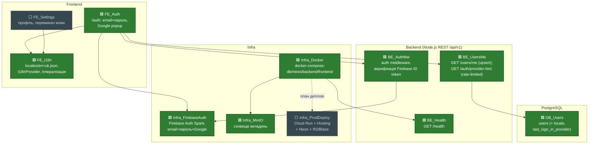
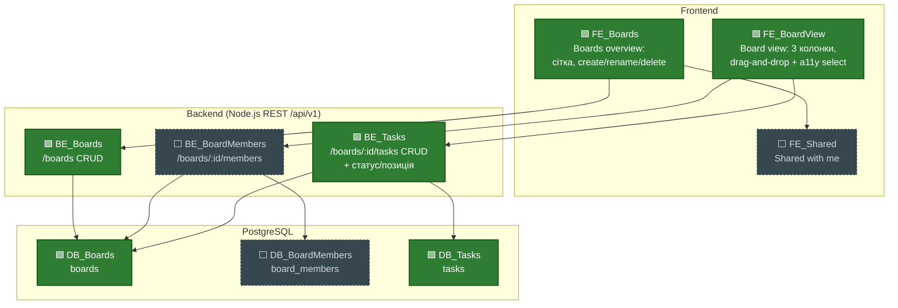
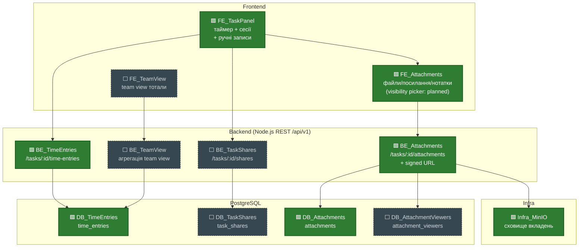
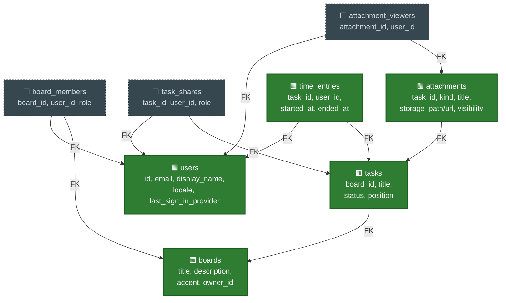

# PROJECT_MAP — Learning Time Tracker

Останнє оновлення: 2026-08-24 — фіча "Час у TaskPanel" (таймер старт/стоп з auto-stop-and-switch, ручні записи, сесії й тотали) заапрувена після одного раунду review; `BE_TimeEntries`, `DB_TimeEntries`, `FE_TaskPanel` позначено `done`.

## Легенда

| Позначка | Клас | Значення |
|---|---|---|
| 🟩 | `done` | FE + BE + БД (де застосовно) реалізовано і пройшло code review |
| 🟨 | `progress` | частково реалізовано (напр. UI без ендпоінта, або ендпоінт без UI) |
| ⬜ | `planned` | ще не почато, лише зафіксовано в специфікації як цільовий обсяг |

Карта розбита на три рядки за функціональними групами (Auth/Infra/Settings; Boards/Sharing; Task panel/Attachments/Team view) — у кожному рядку всі зв'язки замикаються всередині нього, тому стрілки між рядками не перетинаються.

## Рядок 1 — Auth, i18n, Infra

## Рядок 2 — Boards, Board view, шеринг борду

## Рядок 3 — Task panel (час, шеринг таски, вкладення, team view)

## Схема БД (таблиці горизонтально, FK-звʼязки вертикально)

## Відомі прогалини / follow-ups (не блокери, залоговано для пізніше)

- **Orphaned Firebase account при мережевому збої під час signup** (стосується `FE_Auth` / `BE_UsersMe`). Якщо мережа падає між створенням акаунту в Firebase Auth і успішним upsert-запитом до `users`, а користувач перезавантажує сторінку саме в цей момент — акаунт у Firebase лишається без відповідного рядка в `users`, і зараз немає retry/self-heal логіки, яка б це виправила при наступному вході. Виявлено на code review `/auth` (approved with comments), не блокер для мержу. Потребує окремої фічі: або retry upsert при кожному logon, якщо `users` row відсутній, або фонова звірка Firebase Auth ↔ `users`.
- **Task rename UI (`FE_TaskPanel`) додано в обхід звичайного review pipeline.** На явний запит користувача (маленька, добре зрозуміла UI-правка: дзеркалить уже заапрувлений патерн board-rename з `BoardsPage.jsx`, використовує вже протестований і concurrency-safe BE-ендпоінт `PATCH /tasks/:id` без жодних змін на бекенді) — крок tester/code-reviewer цього разу пропущено. Зміни: `frontend/src/components/TaskPanel.jsx` (inline rename-форма: лейбл назви, save/cancel, client-side валідація) + `frontend/src/pages/BoardViewPage.jsx` (синхронізація заголовка картки таски після rename у панелі); нові локалі `task.rename.cta`, `task.rename.titleLabel`, `task.rename.validation.titleRequired`, `task.rename.validation.titleTooLong` — EN/UK повні. Користувач особисто перевірив наживо (успішний rename, валідація пустого/задовгого заголовка, 403 для не-власника), тестові дані прибрано вручну після переривання сесії агента. Статуси вузлів на карті **не змінені**: title-редагування вже неявно охоплювалось описом done-вузлів `BE_Tasks`/`DB_Tasks` ("CRUD"), а `FE_TaskPanel` лишається `progress` (вузол означає секцію "Час", не rename). Рекомендовано провести code-review pass, коли буде зручно — до того часу ця конкретна зміна має нижчу впевненість верифікації, ніж решта `done`-роботи на карті.

## Примітки

- `BE_Health` (`GET /health`) винесений окремим вузлом у BE-шарі Рядка 1, зʼєднаний з `Infra_Docker` — техендпоінт готовності сервісу backend-контейнера, не бізнес-фіча.
- `Infra_MinIO` показаний і в Рядку 1 (піднято в `docker-compose`), і в Рядку 3 (куди `BE_Attachments` писатиме файли) — це один і той самий вузол інфраструктури, повторений у двох діаграмах для наочності, не два різні сховища.
- Секції "Поза межами цього етапу" з CLAUDE.md (публічні посилання, коментарі, нотифікації, календар, складні графіки) свідомо не винесені на карту — вони поза скоупом продукту, не просто "ще не зроблено".
- З фічі Boards/Board view/Task CRUD (2026-08-24): у проєкті зʼявилась перша автоматизована тест-інфраструктура — `vitest` проти окремої тестової Postgres-БД, `backend/test/concurrency/` (6 сценаріїв). Спільні locking-хелпери `backend/src/lib/db.js` (`lockRow`/`lockedUpdate`) і `backend/src/lib/authz.js` (`getOwnedBoard`) — це деталі реалізації всередині вже done-вузлів `BE_Boards`/`BE_Tasks`, окремих вузлів на карті не заведено, щоб не подрібнювати BE-шар нижче рівня ендпоінтів; згадано тут як доступна для наступних фіч база (regression-покриття конкурентних сценаріїв).
- З фічі Task attachments (2026-08-24): `FE_TaskPanel` позначений 🟨 `progress`, не `done` — цей вузол на карті означає саме секцію "Час" (таймер, сесії, ручні записи; звʼязки лишились `FE_TaskPanel --> BE_TimeEntries` і `--> BE_TaskShares`, обидва ще planned). У цій фічі вперше зʼявився сам компонент `TaskPanel` (бічна панель таски) як контейнер, і в ньому повністю реалізовано й заапрувено вкладення — тому додано нову стрілку `FE_TaskPanel --> FE_Attachments`, а `FE_Attachments` позначений `done` окремо. Секція "Час" у цій панелі ще не будувалась. `attachment_viewers`/visibility-picker (`private`/`shared`/`selected`) свідомо не реалізовувались цього разу — зараз усі вкладення `private` за замовчуванням, без UI вибору; `DB_AttachmentViewers` лишається ⬜ до фічі шерингу. `image/svg+xml` виключено зі списку дозволених типів файлів (FE + BE) як вектор stored-XSS — виправлено до approve, не є прогалиною.
- З фічі "Час у TaskPanel" (2026-08-24, US10-US12): `FE_TaskPanel` дороблено до 🟩 `done` — секцію "Час" додано (таймер старт/стоп, живий лічильник, банер auto-stop-and-switch при переключенні активної таски, форма ручного запису, список сесій з edit/delete). `BE_TimeEntries` (6 ендпоінтів: `POST start`, `POST stop`, `POST manual`, `PATCH :entryId`, `DELETE :entryId`, `GET list` на `/tasks/:id/time-entries`) і `DB_TimeEntries` (таблиця `time_entries` + міграція `20260824110000_create_time_entries_table.js`, partial unique index `time_entries_one_active_per_user` на `(user_id) WHERE ended_at IS NULL` — гарантує один активний таймер на користувача на рівні БД) також `done`. Тотали часу додані на `GET /boards/:id/tasks` (`totalSeconds` на тасці, `columnTotals`, `boardTotalSeconds`) і на `GET /boards` (`totalSeconds`, `thisWeekSeconds`, заміна заглушки `board.card.totalTimePlaceholder`) — це розширення контракту вже done-вузлів `BE_Boards`/`BE_Tasks`, окремих вузлів не заведено (той самий принцип, що й для попередніх CRUD-розширень). `thisWeekSeconds` рахується від понеділка 00:00 UTC, фіксовано явно, без локального часу користувача. Приватність: `time_entries` завжди фільтруються `WHERE user_id = requester`; PATCH/DELETE чужого чи неіснуючого запису дають однаковий 404 (anti-enumeration, ніколи 403) — перевірено tester'ом прямим SQL-інсертом "чужого" рядка. Один раунд code review (Request changes → Approve): виправлено race-баг у retry-логіці `startTimer` (ліміт 2 спроби не витримував 3+ одночасних гонщиків) — збільшено до `MAX_START_ATTEMPTS=8` з чесним `errors.timeEntry.startConflict` замість оманливого коду помилки; побічно виправлено баг у `scripts/i18n-check.js` (шлях був `frontend/locales/` замість `frontend/src/locales/` — гейт локалізації мовчки нічого не перевіряв), тепер гейт коректно розрізняє відсутні в EN ICU plural-категорії (`few`/`many`) від справжніх пропусків перекладу. Новий тестовий файл `backend/test/concurrency/timeEntries.concurrency.test.js` (4 сценарії: подвійний старт таймера з двох вкладок, PATCH-vs-DELETE, DELETE-vs-DELETE на той самий запис) — разом з попередніми доводить concurrency-покриття до 12 сценаріїв (боарди/таски/вкладення/час).
