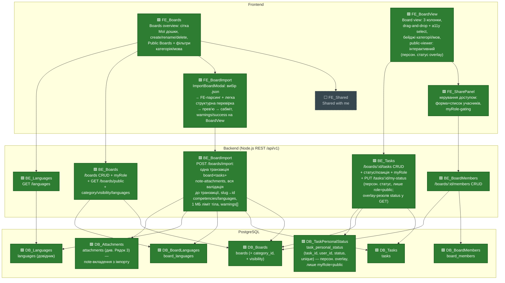
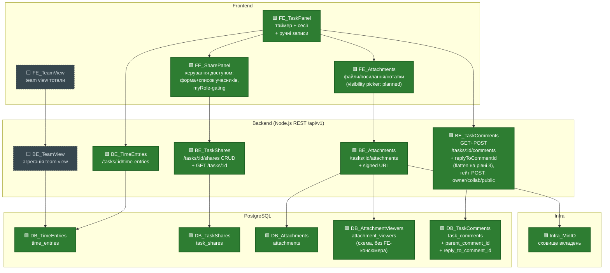
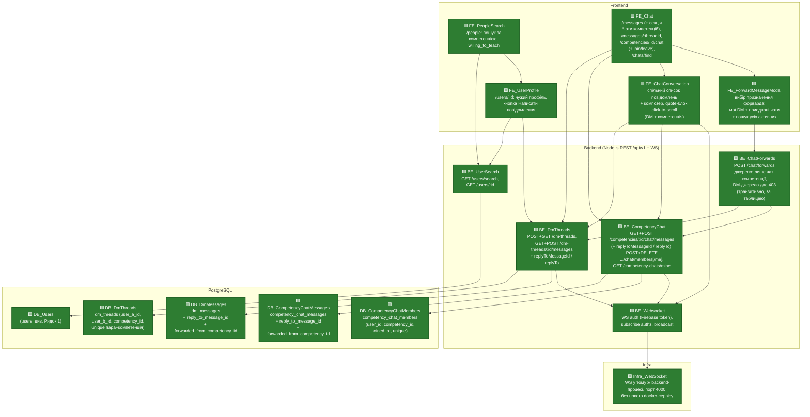

# PROJECT_MAP — Learning Time Tracker

Останнє оновлення: 2026-08-27 — персональний статус таски для глядача публічного борду без членства + право коментувати (US-039 BE + US-040 FE, коміт `315febd`). Новий вузол `DB_TaskPersonalStatus` (Рядок 2 + ER-схема) — таблиця `task_personal_status`; `BE_Tasks` отримав `PUT /tasks/:id/my-status` і overlay-резолв `status` для `myRole='public'`; `BE_TaskComments` — гейт `POST` розширено на роль `public`; `FE_BoardView` став інтерактивним для публічного глядача. Свідоме звуження інваріантів CLAUDE.md ("статус спільний" / "коментарі без права додавати") виключно для випадку публічний борд + глядач без реального членства.

## Легенда

| Позначка | Клас | Значення |
|---|---|---|
| 🟩 | `done` | FE + BE + БД (де застосовно) реалізовано і пройшло code review |
| 🟨 | `progress` | частково реалізовано (напр. UI без ендпоінта, або ендпоінт без UI) |
| ⬜ | `planned` | ще не почато, лише зафіксовано в специфікації як цільовий обсяг |

Карта розбита на чотири рядки за функціональними групами (Auth/Infra/Settings; Boards/Sharing; Task panel/Attachments/Team view; Месенджинг: пошук профілів/DM/груповий чат компетенції/WebSocket) — у кожному рядку всі зв'язки замикаються всередині нього, тому стрілки між рядками не перетинаються.

## Рядок 1 — Auth, i18n, Infra

```mermaid
graph TD
  classDef done fill:#2e7d32,color:#ffffff,stroke:#1b5e20,stroke-width:2px;
  classDef progress fill:#f9a825,color:#1a1a1a,stroke:#f57f17,stroke-width:2px;
  classDef planned fill:#37474f,color:#cfd8dc,stroke:#263238,stroke-width:1px,stroke-dasharray: 3 3;

  subgraph FE["Frontend"]
    FE_i18n["🟩 FE_i18n<br/>locales/en+uk.json,<br/>I18nProvider, плюралізація"]
    FE_Auth["🟩 FE_Auth<br/>/auth: email+пароль,<br/>Google popup"]
    FE_AppHeader["🟩 FE_AppHeader<br/>спільна шапка:<br/>перемикач мови EN/UK,<br/>посилання на профіль"]
    FE_ProfilePage["🟩 FE_ProfilePage<br/>/profile: public_name,<br/>компетенції + willing-to-teach"]
  end

  subgraph BE["Backend (Node.js REST /api/v1)"]
    BE_Health["🟩 BE_Health<br/>GET /health"]
    BE_AuthMw["🟩 BE_AuthMw<br/>auth middleware,<br/>верифікація Firebase ID token"]
    BE_UsersMe["🟩 BE_UsersMe<br/>GET+PATCH /users/me<br/>(upsert, public_name,<br/>locale), GET /auth/provider-hint"]
    BE_Competencies["🟩 BE_Competencies<br/>GET /competencies,<br/>/users/me/competencies CRUD"]
  end

  subgraph DB["PostgreSQL"]
    DB_Users["🟩 DB_Users<br/>users (+ locale,<br/>last_sign_in_provider,<br/>public_name)"]
    DB_Competencies["🟩 DB_Competencies<br/>competencies (довідник)"]
    DB_UserCompetencies["🟩 DB_UserCompetencies<br/>user_competencies"]
  end

  subgraph Infra["Infra"]
    Infra_Docker["🟩 Infra_Docker<br/>docker-compose:<br/>db/minio/backend/frontend"]
    Infra_FirebaseAuth["🟩 Infra_FirebaseAuth<br/>Firebase Auth Spark,<br/>email+пароль+Google"]
    Infra_MinIO["🟩 Infra_MinIO<br/>сховище вкладень"]
    Infra_ProdDeploy["⬜ Infra_ProdDeploy<br/>Cloud Run + Hosting<br/>+ Neon + R2/Blaze"]
  end

  FE_Auth --> FE_i18n
  FE_ProfilePage --> FE_i18n
  FE_AppHeader --> FE_i18n
  FE_AppHeader --> BE_UsersMe
  FE_AppHeader --> FE_ProfilePage
  FE_Auth --> BE_AuthMw
  FE_Auth --> BE_UsersMe
  FE_Auth --> Infra_FirebaseAuth
  BE_AuthMw --> Infra_FirebaseAuth
  BE_UsersMe --> DB_Users
  FE_ProfilePage --> BE_UsersMe
  FE_ProfilePage --> BE_Competencies
  BE_Competencies --> DB_Competencies
  BE_Competencies --> DB_UserCompetencies
  Infra_Docker --> BE_Health
  Infra_Docker --> Infra_MinIO
  Infra_Docker -.план деплою.-> Infra_ProdDeploy

  class FE_i18n,FE_Auth,FE_AppHeader,FE_ProfilePage,BE_Health,BE_AuthMw,BE_UsersMe,BE_Competencies,DB_Users,DB_Competencies,DB_UserCompetencies,Infra_Docker,Infra_FirebaseAuth,Infra_MinIO done;
  class Infra_ProdDeploy planned;
```

## Рядок 2 — Boards, Board view, шеринг борду

## Рядок 3 — Task panel (час, шеринг таски, вкладення, team view)

## Рядок 4 — Месенджинг (пошук профілів, DM-чат, груповий чат компетенції, WebSocket)

## Схема БД (таблиці горизонтально, FK-звʼязки вертикально)

```mermaid
graph TD
  classDef done fill:#2e7d32,color:#ffffff,stroke:#1b5e20,stroke-width:2px;
  classDef progress fill:#f9a825,color:#1a1a1a,stroke:#f57f17,stroke-width:2px;
  classDef planned fill:#37474f,color:#cfd8dc,stroke:#263238,stroke-width:1px,stroke-dasharray: 3 3;

  DB_BoardMembers["🟩 board_members<br/>board_id, user_id, role"]
  DB_TaskShares["🟩 task_shares<br/>task_id, user_id, role"]
  DB_AttachmentViewers["🟩 attachment_viewers<br/>attachment_id, user_id"]
  DB_UserCompetencies["🟩 user_competencies<br/>user_id, competency_id,<br/>is_custom, willing_to_teach"]
  DB_TaskComments["🟩 task_comments<br/>task_id, author_id, body, created_at,<br/>parent_comment_id, reply_to_comment_id"]
  DB_BoardLanguages["🟩 board_languages<br/>board_id, language_id"]
  DB_DmMessages["🟩 dm_messages<br/>thread_id, sender_id, body, created_at,<br/>reply_to_message_id,<br/>forwarded_from_competency_id"]
  DB_CompetencyChatMembers["🟩 competency_chat_members<br/>user_id, competency_id,<br/>joined_at, unique"]
  DB_TaskPersonalStatus["🟩 task_personal_status<br/>task_id, user_id, status,<br/>created_at, updated_at,<br/>unique(task_id, user_id)"]

  DB_Users["🟩 users<br/>id, email, display_name,<br/>public_name, locale,<br/>last_sign_in_provider"]
  DB_Attachments["🟩 attachments<br/>task_id, kind, title,<br/>storage_path/url, visibility"]
  DB_TimeEntries["🟩 time_entries<br/>task_id, user_id,<br/>started_at, ended_at"]
  DB_Competencies["🟩 competencies<br/>slug, is_active"]
  DB_Languages["🟩 languages<br/>slug, is_active"]
  DB_DmThreads["🟩 dm_threads<br/>user_a_id, user_b_id,<br/>competency_id,<br/>unique пара+компетенція"]
  DB_CompetencyChatMessages["🟩 competency_chat_messages<br/>competency_id, sender_id, body, created_at,<br/>reply_to_message_id,<br/>forwarded_from_competency_id"]

  DB_Tasks["🟩 tasks<br/>board_id, title,<br/>status, position,<br/>planned_minutes"]

  DB_Boards["🟩 boards<br/>title, description,<br/>accent, owner_id,<br/>category_id, visibility"]

  DB_BoardMembers -->|FK| DB_Boards
  DB_BoardMembers -->|FK| DB_Users
  DB_TaskShares -->|FK| DB_Tasks
  DB_TaskShares -->|FK| DB_Users
  DB_TimeEntries -->|FK| DB_Tasks
  DB_TimeEntries -->|FK| DB_Users
  DB_AttachmentViewers -->|FK| DB_Attachments
  DB_AttachmentViewers -->|FK| DB_Users
  DB_UserCompetencies -->|FK| DB_Users
  DB_UserCompetencies -.FK, nullable.-> DB_Competencies
  DB_TaskComments -->|FK, CASCADE| DB_Tasks
  DB_TaskComments -->|FK| DB_Users
  DB_TaskComments -.FK self, parent CASCADE / reply_to SET NULL.-> DB_TaskComments
  DB_TaskPersonalStatus -->|FK, CASCADE| DB_Tasks
  DB_TaskPersonalStatus -->|FK, CASCADE| DB_Users
  DB_BoardLanguages -->|FK| DB_Boards
  DB_BoardLanguages -->|FK| DB_Languages
  DB_Attachments -->|FK| DB_Tasks
  DB_Tasks -->|FK| DB_Boards
  DB_Boards -.FK, nullable.-> DB_Competencies
  DB_DmThreads -->|FK x2| DB_Users
  DB_DmThreads -->|FK| DB_Competencies
  DB_DmMessages -->|FK| DB_DmThreads
  DB_DmMessages -->|FK| DB_Users
  DB_DmMessages -.FK self, SET NULL.-> DB_DmMessages
  DB_DmMessages -.FK, nullable (forwarded_from).-> DB_Competencies
  DB_CompetencyChatMessages -->|FK| DB_Competencies
  DB_CompetencyChatMessages -->|FK| DB_Users
  DB_CompetencyChatMessages -.FK self, SET NULL.-> DB_CompetencyChatMessages
  DB_CompetencyChatMessages -.FK, nullable (forwarded_from).-> DB_Competencies
  DB_CompetencyChatMembers -->|FK| DB_Users
  DB_CompetencyChatMembers -->|FK| DB_Competencies

  class DB_Users,DB_Tasks,DB_Boards,DB_Attachments,DB_TimeEntries,DB_BoardMembers,DB_TaskShares,DB_AttachmentViewers,DB_UserCompetencies,DB_Competencies,DB_TaskComments,DB_Languages,DB_BoardLanguages,DB_DmThreads,DB_DmMessages,DB_CompetencyChatMessages,DB_CompetencyChatMembers,DB_TaskPersonalStatus done;
```

## Відомі прогалини / follow-ups (не блокери, залоговано для пізніше)

- **Orphaned Firebase account при мережевому збої під час signup** (стосується `FE_Auth` / `BE_UsersMe`). Якщо мережа падає між створенням акаунту в Firebase Auth і успішним upsert-запитом до `users`, а користувач перезавантажує сторінку саме в цей момент — акаунт у Firebase лишається без відповідного рядка в `users`, і зараз немає retry/self-heal логіки, яка б це виправила при наступному вході. Виявлено на code review `/auth` (approved with comments), не блокер для мержу. Потребує окремої фічі: або retry upsert при кожному logon, якщо `users` row відсутній, або фонова звірка Firebase Auth ↔ `users`.
- **Task rename UI (`FE_TaskPanel`) додано в обхід звичайного review pipeline.** На явний запит користувача (маленька, добре зрозуміла UI-правка: дзеркалить уже заапрувлений патерн board-rename з `BoardsPage.jsx`, використовує вже протестований і concurrency-safe BE-ендпоінт `PATCH /tasks/:id` без жодних змін на бекенді) — крок tester/code-reviewer цього разу пропущено. Зміни: `frontend/src/components/TaskPanel.jsx` (inline rename-форма: лейбл назви, save/cancel, client-side валідація) + `frontend/src/pages/BoardViewPage.jsx` (синхронізація заголовка картки таски після rename у панелі); нові локалі `task.rename.cta`, `task.rename.titleLabel`, `task.rename.validation.titleRequired`, `task.rename.validation.titleTooLong` — EN/UK повні. Користувач особисто перевірив наживо (успішний rename, валідація пустого/задовгого заголовка, 403 для не-власника), тестові дані прибрано вручну після переривання сесії агента. Статуси вузлів на карті **не змінені**: title-редагування вже неявно охоплювалось описом done-вузлів `BE_Tasks`/`DB_Tasks` ("CRUD"), а `FE_TaskPanel` лишається `progress` (вузол означає секцію "Час", не rename). Рекомендовано провести code-review pass, коли буде зручно — до того часу ця конкретна зміна має нижчу впевненість верифікації, ніж решта `done`-роботи на карті.
- **Відсутнє автотест-покриття для `task_shares`-override-публічної-ролі на task-рівні** (стосується `BE_Tasks`/`backend/src/lib/authz.js`, US-022 AC7). Сценарій "публічний відвідувач борду (`myRole='public'`) з реальним `task_shares`-рядком на конкретній тасці бачить справжню роль з `task_shares`, а не `'public'`" — перевірений вручну ad-hoc скриптом при розробці, але не заведений у `backend/test/concurrency/boardCategoryVisibilityLanguages.test.js` чи інший файл suite. Non-blocker зауваження code-reviewer'а (Approve with comments, `994310a`). Логіка (`higherRole` у `authz.js`) написана коректно й задокументована коментарями в коді, потребує лише регресійного тесту.
- **Дрімаючий N+1 у `attachments.service.js`** для перевірки `selected`-visibility (`isVisibleTo` став `async` у цій фічі, US-022 AC4). Неактивний зараз — усі вкладення досі `private`/`shared` за замовчуванням, `selected`-picker у UI ще не збудований (лишається "(visibility picker: planned)" на `FE_Attachments`, Рядок 3), тож гілка з потенційним N+1 фактично не виконується жодним існуючим шляхом. Non-blocker зауваження code-reviewer'а (Approve with comments, `994310a`) — виправити (батчинг запиту до `attachment_viewers`) до або одночасно з реалізацією visibility-picker'а, щоб проблема не "прокинулась" непоміченою разом з новим UI.

## Примітки

- `BE_Health` (`GET /health`) винесений окремим вузлом у BE-шарі Рядка 1, зʼєднаний з `Infra_Docker` — техендпоінт готовності сервісу backend-контейнера, не бізнес-фіча.
- `Infra_MinIO` показаний і в Рядку 1 (піднято в `docker-compose`), і в Рядку 3 (куди `BE_Attachments` писатиме файли) — це один і той самий вузол інфраструктури, повторений у двох діаграмах для наочності, не два різні сховища.
- `FE_SharePanel` (доданий у фічі "Board & Task Sharing", 2026-08-24) показаний і в Рядку 2 (керує `board_members` з `FE_BoardView`), і в Рядку 3 (керує `task_shares` з `FE_TaskPanel`) — за тим самим принципом повтору, що й `Infra_MinIO`: один і той самий компонент (`frontend/src/components/SharePanel.jsx`), що обслуговує обидва контексти шерингу, а не два різні компоненти.
- Секції "Поза межами цього етапу" з CLAUDE.md (публічні посилання, коментарі, нотифікації, календар, складні графіки) свідомо не винесені на карту — вони поза скоупом продукту, не просто "ще не зроблено".
- З фічі Boards/Board view/Task CRUD (2026-08-24): у проєкті зʼявилась перша автоматизована тест-інфраструктура — `vitest` проти окремої тестової Postgres-БД, `backend/test/concurrency/` (6 сценаріїв). Спільні locking-хелпери `backend/src/lib/db.js` (`lockRow`/`lockedUpdate`) і `backend/src/lib/authz.js` (`getOwnedBoard`) — це деталі реалізації всередині вже done-вузлів `BE_Boards`/`BE_Tasks`, окремих вузлів на карті не заведено, щоб не подрібнювати BE-шар нижче рівня ендпоінтів; згадано тут як доступна для наступних фіч база (regression-покриття конкурентних сценаріїв).
- З фічі Task attachments (2026-08-24): `FE_TaskPanel` позначений 🟨 `progress`, не `done` — цей вузол на карті означає саме секцію "Час" (таймер, сесії, ручні записи; звʼязки лишились `FE_TaskPanel --> BE_TimeEntries` і `--> BE_TaskShares`, обидва ще planned). У цій фічі вперше зʼявився сам компонент `TaskPanel` (бічна панель таски) як контейнер, і в ньому повністю реалізовано й заапрувено вкладення — тому додано нову стрілку `FE_TaskPanel --> FE_Attachments`, а `FE_Attachments` позначений `done` окремо. Секція "Час" у цій панелі ще не будувалась. `attachment_viewers`/visibility-picker (`private`/`shared`/`selected`) свідомо не реалізовувались цього разу — зараз усі вкладення `private` за замовчуванням, без UI вибору; `DB_AttachmentViewers` лишається ⬜ до фічі шерингу. `image/svg+xml` виключено зі списку дозволених типів файлів (FE + BE) як вектор stored-XSS — виправлено до approve, не є прогалиною.
- З фічі "Board & Task Sharing" (2026-08-24, US13-US17): `BE_BoardMembers`/`DB_BoardMembers` і `BE_TaskShares`/`DB_TaskShares` дороблено з ⬜ `planned` до 🟩 `done` — CRUD-ендпоінти `/boards/:id/members` і `/tasks/:id/shares` (8 нових ендпоінтів), новий `GET /tasks/:id`, `myRole` додано в 3 наявних ендпоінти (`GET /boards`, `GET /boards/:id/tasks`, `GET /tasks/:id`) — розширення контракту вже done-вузлів `BE_Boards`/`BE_Tasks`, за тим самим принципом, що й попередні CRUD-розширення (тотали, статуси). `DB_AttachmentViewers` також переведено в `done` — таблиця й FK існують і пройшли review, але це досі суто схема без FE-консюмера: visibility picker (`private`/`shared`/`selected`) у самих вкладеннях не будувався цього разу, `FE_Attachments` і надалі позначений "(visibility picker: planned)" без змін. Новий вузол `FE_SharePanel` (форма шерингу за email, список учасників з ролями, owner-рядок) доданий в обидва рядки (2 і 3) — замінив прямі стрілки `FE_BoardView --> BE_BoardMembers` і `FE_TaskPanel --> BE_TaskShares` на `--> FE_SharePanel -->`, оскільки шеринг тепер реально проходить через цей UI-компонент, а не є заглушкою. `frontend/src/lib/roles.js` (`canWrite`) і gating за `myRole` у `BoardViewPage.jsx`/`TaskPanel.jsx` — деталі реалізації всередині вже задокументованих FE-вузлів, окремих вузлів не заведено. Авторизація: `backend/src/lib/authz.js` розширено ефективною роллю owner/collaborator/viewer з пріоритетом board-level над task-level (`max(board role, task role)`, task-level ніколи не поширюється на інші таски того ж борду) і флагом `hasBoardAccess` — деталь реалізації всередині `BE_Boards`/`BE_Tasks`/`BE_TaskShares`, окремого вузла не заведено, той самий принцип, що вже застосований до `lockRow`/`getOwnedBoard`. Приватність часу лишається per-user незалежно від ролі (viewer теж таймить власний час, чужі рядки `time_entries` ніколи не повертаються). Два раунди tester (обидва фінально PASS) і два раунди code review: перший — Request changes через reindex-leak (стейл `myRole`/доступ у in-memory кеші після зміни ролі всередині того самого запиту переживав reindex списку і міг віддати застарілий дозвіл), другий — Approve, закомічено як `02de849`. Також виправлено мертвий locale-ключ у `SharePanel` і відсутній FK-індекс — обидва до approve, не відкладено. Свідомо не торкались: `FE_Shared` ("Shared with me" секція) і `FE_TeamView`/`BE_TeamView` — обидва лишаються ⬜ `planned`, поза скоупом цієї фічі (реалізовано лише саме керування доступом і UI шерингу).
- З фічі "Board/task description у FE" (2026-08-24): `boards.description` і `tasks.notes` існували в БД/BE й раніше (закладені в схему з самого початку), але не мали жодного UI — ця фіча підключає обидва поля до FE, без зміни схеми й без нових ендпоінтів. Board: форма створення, inline-форма перейменування, 2-рядковий preview на картці борду, заголовок Board view. Task: форма створення (`BoardViewPage.jsx`) і нова секція опису в `TaskPanel.jsx` (перегляд/редагування, дзеркалить UX уже існуючого title-rename) — свідомо перевикористовує вже наявну колонку `notes`, релейбловану "Description" в UI, а не нова колонка. Додано валідацію 2000 символів на BE для обох полів (раніше не валідувалось для `boards.description`, вперше з'явилось для `tasks.notes`) з відповідними error-ключами, повні EN/UK локалі, оновлення `openapi.yaml`. Статуси вузлів на карті **не змінені** і нових вузлів не додано — фіча повністю лягла всередину вже done-вузлів `FE_Boards`, `FE_BoardView`, `FE_TaskPanel`, `BE_Boards`, `BE_Tasks`, `DB_Boards`, `DB_Tasks`: це UI- і валідаційне розширення вже задокументованих CRUD-ендпоінтів, той самий принцип, що й попередні розширення контракту (тотали, myRole, шеринг). Code review → Approve.
- З фічі "Профіль користувача" (2026-08-24, AUTH-004…AUTH-007): новий вузол `FE_ProfilePage` (`/profile`) замінив попередній planned-заглушку `FE_Settings` ("профіль, перемикач мови") у Рядку 1 — і навмисно позначений 🟨 `progress`, не `done`. У цьому проході повністю реалізовано й пройшло tester+code review: редагування `public_name` (з фолбеком на системний `display_name`), додавання компетенцій з довідника й вручну (custom), per-competency перемикач "готовий викладати" — усі чотири story (AUTH-004…AUTH-007) закриті. **Перемикач мови на `/profile` НЕ реалізований цього разу** — `frontend/src/pages/ProfilePage.jsx` не містить відповідного UI; формулювання нового п.5 "User profile" в CLAUDE.md ("перемикач мови (див. розділ 'Локалізація')") зафіксовано заздалегідь разом з рештою екрана, але саму мовну частину ще не збудовано — те саме зауваження зробив code-reviewer при Approve with comments. Не позначати `FE_ProfilePage` як `done`, доки локале-перемикач не буде реалізовано і заверифіковано окремою фічею. Нові `done`-вузли: `BE_Competencies` (`GET /competencies` — довідник; `GET/POST/PATCH/DELETE /users/me/competencies` — власні записи користувача, anti-enumeration на чужий `:id` через 404, той самий підхід, що й для `time_entries`), `DB_Competencies` (таблиця `competencies`, засіджена 6 slug'ами з locale-ключами `competency.<slug>` в обох словниках), `DB_UserCompetencies` (таблиця `user_competencies`, `UNIQUE(user_id, competency_id)` як backstop проти дублю з довідника; дублі custom-записів свідомо дозволені — NULL у `competency_id` не конфліктує). Вже задокументовані `done`-вузли розширені без зміни статусу: `BE_UsersMe` отримав `PATCH /users/me` (тільки `publicName`, часткове оновлення — відсутнє поле в тілі не чіпає `public_name`); `DB_Users` отримав колонку `public_name`. Побічний контрактний ефект на вже `done` вузлах шерингу — `BE_BoardMembers`/`BE_TaskShares` (`toMember`/`toShare` у відповідних сервісах) тепер віддають `displayName` як `public_name || display_name` замість завжди `display_name` у списках учасників борду/шерингу таски (AUTH-004 AC5/AC6) — на карті це не окрема стрілка (обидва вузли лишаються в Рядку 2/3, `DB_Users` — у Рядку 1, міжрядкові стрілки навмисно не проводяться), зафіксовано тут текстом. Один раунд code review: Approve with comments (єдине зауваження — саме про недобудований перемикач мови, враховано вище).
- З фічі "Перемикач мови у AppHeader" (2026-08-24, AUTH-008): новий вузол `FE_AppHeader` (🟩 `done`) — спільна шапка з перемикачем мови EN/UK (будується з реєстру підтримуваних локалей, без хардкоду на дві конкретні мови, AC2) і посиланням на `/profile`; рендериться на всіх автентифікованих екранах (Boards overview, Board view, Profile) і навмисно відсутня на `/auth` (AC10). Показаний лише в Рядку 1, щоб не проводити міжрядкові стрілки — те, що компонент фактично використовується й з `FE_Boards`, і з `FE_BoardView`, і з `FE_TaskPanel`, зафіксовано тут текстом, а не окремим вузлом чи стрілками в Рядках 2/3 (на відміну від `Infra_MinIO`/`FE_SharePanel`, які повторюються на кількох діаграмах, — тут дублювання визнано зайвою деталізацією для одного UI-фрагмента шапки). `FE_ProfilePage` доведено до 🟩 `done` — мітка "(перемикач мови: planned)" знята, оскільки перемикач свідомо переїхав у `AppHeader` (зміна раніше задокументованого розміщення, узгоджена в CLAUDE.md, розділи "Локалізація" і п.5 "User profile"), а не тому, що добудований на самій сторінці профілю; це знімає застереження з попереднього запису нижче ("Не позначати `FE_ProfilePage` як done, доки локале-перемикач не буде реалізовано") — умова знята рішенням про перенесення scope, а не реалізацією у старому місці. `BE_UsersMe` розширено без зміни статусу (вже був `done`): `PATCH /users/me` тепер приймає опційний `locale` (той самий частковий-апдейт патерн, що й `publicName`, AUTH-004 AC8), нова помилка валідації `errors.profile.localeInvalid`. `DB_Users.locale` — колонка вже існувала з AUTH-001…003, схема не змінювалась. Новий FE-хук `frontend/src/i18n/useLocaleSync.js` (one-shot ре-адопція збереженого `users.locale` при reload/новій вкладці для вже автентифікованої сесії — фіксить F5 locale-desync баг, знайдений tester на першому проході) — деталь реалізації всередині `FE_AppHeader`/`FE_i18n`, окремого вузла не заведено (той самий принцип, що й `roles.js`/`authz.js` раніше). Один раунд code review: Approve with comments (без блокерів) — теоретичне (невідтворюване) race-вікно в порівнянні ref у `useLocaleSync`, зайвий `GET /users/me` одразу після sign-in, неочищений `setTimeout` у toast помилки синхронізації в `AppHeader`; жодне не блокер, зафіксовано тут для прозорості. Закомічено як `2dfad58`.
- З фічі "Час у TaskPanel" (2026-08-24, US10-US12): `FE_TaskPanel` дороблено до 🟩 `done` — секцію "Час" додано (таймер старт/стоп, живий лічильник, банер auto-stop-and-switch при переключенні активної таски, форма ручного запису, список сесій з edit/delete). `BE_TimeEntries` (6 ендпоінтів: `POST start`, `POST stop`, `POST manual`, `PATCH :entryId`, `DELETE :entryId`, `GET list` на `/tasks/:id/time-entries`) і `DB_TimeEntries` (таблиця `time_entries` + міграція `20260824110000_create_time_entries_table.js`, partial unique index `time_entries_one_active_per_user` на `(user_id) WHERE ended_at IS NULL` — гарантує один активний таймер на користувача на рівні БД) також `done`. Тотали часу додані на `GET /boards/:id/tasks` (`totalSeconds` на тасці, `columnTotals`, `boardTotalSeconds`) і на `GET /boards` (`totalSeconds`, `thisWeekSeconds`, заміна заглушки `board.card.totalTimePlaceholder`) — це розширення контракту вже done-вузлів `BE_Boards`/`BE_Tasks`, окремих вузлів не заведено (той самий принцип, що й для попередніх CRUD-розширень). `thisWeekSeconds` рахується від понеділка 00:00 UTC, фіксовано явно, без локального часу користувача. Приватність: `time_entries` завжди фільтруються `WHERE user_id = requester`; PATCH/DELETE чужого чи неіснуючого запису дають однаковий 404 (anti-enumeration, ніколи 403) — перевірено tester'ом прямим SQL-інсертом "чужого" рядка. Один раунд code review (Request changes → Approve): виправлено race-баг у retry-логіці `startTimer` (ліміт 2 спроби не витримував 3+ одночасних гонщиків) — збільшено до `MAX_START_ATTEMPTS=8` з чесним `errors.timeEntry.startConflict` замість оманливого коду помилки; побічно виправлено баг у `scripts/i18n-check.js` (шлях був `frontend/locales/` замість `frontend/src/locales/` — гейт локалізації мовчки нічого не перевіряв), тепер гейт коректно розрізняє відсутні в EN ICU plural-категорії (`few`/`many`) від справжніх пропусків перекладу. Новий тестовий файл `backend/test/concurrency/timeEntries.concurrency.test.js` (4 сценарії: подвійний старт таймера з двох вкладок, PATCH-vs-DELETE, DELETE-vs-DELETE на той самий запис) — разом з попередніми доводить concurrency-покриття до 12 сценаріїв (боарди/таски/вкладення/час).
- З фічі "Bug fix: розгортання нотатки" (2026-08-25, US-018): виправлення всередині вже done-вузла `FE_Attachments` — статус на карті не змінюється, нового вузла не заведено. Чіп вкладення-нотатки (`attachment.kind=note`) тепер розгортається/згортається інлайн по кліку на контрол "Показати більше"/"Показати менше" (`aria-expanded`, keyboard-підтримка Tab+Enter/Space) замість обрізання тексту без будь-якого способу прочитати його повністю. Presentation-only фікс: `body` нотатки вже повністю зберігався в БД і повертався `GET`-ендпоінтом вкладень з моменту US-009 — обрізання відбувалось лише в рендері FE, тому BE й схема тут узагалі не чіпались, жодного нового мережевого запиту розгортання не робить. Поведінка ідентична для всіх значень `visibility` (`private`/`shared`/`selected`) — фікс не зачіпає гейт видимості вкладень (той самий існуючий контроль доступу з US-009/US-016). Tester: PASS through кодове рев'ю (живий браузерний клік не перевірено — заблоковано sandbox-класифікатором середовища при спробі тестової автентифікації, не баг коду; зафіксовано тут для прозорості, той самий клас обмеження, що й для US-019/US-020 нижче).
- З фічі "Коментарі до таски (US-019) та оцінений час (US-020)" (2026-08-25, коміт `85ae7e5`): свідома зміна scope, узгоджена до реалізації (той самий прецедент, що AUTH-003/AUTH-004…008/AUTH-008) — пункт "коментарі/обговорення" прибрано з розділу CLAUDE.md "Поза межами цього етапу". Нові `done`-вузли в Рядку 3: `BE_TaskComments` (`GET`+`POST /tasks/:id/comments`, авторизація читання — той самий `can_view_task`, що вже використовується для attachments/time-entries; авторизація запису — owner/collaborator, viewer отримує 403 `errors.task.readOnlyAccess`, реюз ключа з US-016) і `DB_TaskComments` (таблиця `task_comments`: `task_id` FK `ON DELETE CASCADE` на `tasks`, `author_id` FK на `users`, `body`, `created_at`, складений індекс на `(task_id, created_at)` під сортування списку) — обидва зʼєднані `FE_TaskPanel --> BE_TaskComments --> DB_TaskComments`, поруч із гілкою `BE_Attachments`/`DB_Attachments`, за тим самим структурним принципом. Ключове продуктове рішення: коментарі спільні для всіх з доступом до таски/борду (як статус таски), MVP без edit/delete. `planned_minutes` (US-020) — нова колонка `tasks.planned_minutes` (nullable int, скид у NULL при 0/порожніх полях) і розширення `PATCH /tasks/:id` полем `plannedMinutes` — це розширення вже done-вузлів `BE_Tasks`/`DB_Tasks`, за тим самим принципом, що й попередні розширення контракту (тотали, myRole, шеринг, опис): окремого вузла не заведено, лише позначка нової колонки в лейблі `DB_Tasks` на діаграмі схеми БД. `GET /tasks/:id` і `GET /boards/:id/tasks` розширені тим самим полем `plannedMinutes` поруч з уже наявним `totalSeconds` — той самий гейт `errors.task.readOnlyAccess`/`errors.task.forbidden`, що вже діє для інших полів таски. Code review: Approve with comments, два non-blocker зауваження — застаріле локальне state форми при перемиканні таски без remount панелі (пре-існуючий патерн з `FE_TaskPanel`, тепер поширений і на нові поля коментарів/оцінки часу, не новий борг) і непов'язані transitive npm audit вразливості в ланцюжку залежностей `firebase-admin` (поза скоупом цієї фічі). Tester: PASS with notes — усі 24 AC перевірені кодовим рев'ю + повним BE test suite 55/55 (нові файли `backend/test/concurrency/taskComments.test.js` і `plannedMinutes.test.js`) + прямими API auth-перевірками; живий браузерний клік не перевірено — заблоковано sandbox-класифікатором середовища при спробі тестової автентифікації, не баг коду.
- З фічі "Категорії, публічна видимість і мови борду + реструктуризація Boards overview" (2026-08-25, US-021…US-024, коміт `994310a`): нова, раніше відсутня в CLAUDE.md концепція — публічна (без запрошення) read-only видимість борда, третій рівень доступу поряд з `board_members`/`task_shares`. Реалізовано новою ефективною роллю `public` у `backend/src/lib/authz.js` (`ROLE_RANK.public = 1`, той самий ранг, що `viewer` — тому всі наявні `minRole: 'viewer'`-гейти читання пропускають публічного відвідувача безкоштовно, а всі `minRole: 'collaborator'`-гейти запису відхиляють його безкоштовно, без окремих `public`-гілок на кожному ендпоінті); реальне членство завжди переважає (`higherRole` явно тай-брейкає `public` проти будь-якої реальної ролі, US-022 AC7). Приватність `time_entries` і гейт `visibility` вкладень (`private`/`shared`/`selected`) лишаються повністю чинними й для публічного відвідувача — жодного винятку (US-022 AC4-5). Нові `done`-вузли в Рядку 2: `BE_Languages` (`GET /languages`, той самий контракт, що вже done `BE_Competencies`) і `DB_Languages`/`DB_BoardLanguages` (нова таблиця-довідник + junction, патерн `competencies`/`board_members` — на відміну від `category_id`/`visibility`, які лягли просто новими колонками на вже done `DB_Boards` без нових вузлів). Розширені без зміни статусу: `FE_Boards` (нова секція "Public Boards" з фільтрами категорія+мова, поряд із семантично незміненою "Мої дошки"), `FE_BoardView` (бейджі категорії/мов, банер `sharing.publicViewerBanner` для `myRole==='public'`), `BE_Boards` (`GET /boards/public`, поля `categoryId`/`visibility`/`languageIds` у CRUD). Owner-only гейт на всі три нові поля борда — не нове правило, застосування вже наявного гейту з US-003/US-015 до нових полів. **CLAUDE.md текстом ще НЕ оновлено цим проходом** — формулювання для розділів "Дані"/"Шеринг"/"Екрани" п.2 підготовлені бізнес-аналітиком у `USER_STORIES.md` (перед US-021), але за прямою вказівкою в запиті на цю серію stories сам CLAUDE.md не редагувався (на відміну від прецеденту AUTH-008/US-018…US-020, де CLAUDE.md оновлювався одразу тим самим проходом) — застосування цих правок узгоджується окремим кроком. Code review: Approve with comments, два non-blocker зауваження зафіксовані окремо в розділі "Відомі прогалини" вище (відсутній автотест на `task_shares`-override-`public` на task-рівні; дрімаючий N+1 у `attachments.service.js`). Tester: PASS with notes — 87/87 backend-тестів (новий файл `backend/test/concurrency/boardCategoryVisibilityLanguages.test.js`) + 20 AC звірено вручну через реальні HTTP-запити з Firebase test-users; один мінорний баг ("брудна" форма `languages` у відповіді `POST /boards`) знайдено й виправлено до code review.
- З фічі "Месенджинг: пошук профілів, чужий профіль, DM-чат, груповий чат компетенції, WebSocket-інфраструктура" (2026-08-25, US-025…US-029, коміт `3b4163e`): **принципово нова функціональна область** — до цього проєкт мав лише трекінг часу борду/тасок, жодного месенджингу чи WebSocket не існувало; тому вперше заведено окремий **Рядок 4** замість розширення Рядків 1-3 (за аналогією з тим, як Рядки 2/3 колись виникли для Boards і Task panel відповідно). Нові `done`-вузли: `FE_PeopleSearch` (`/people`), `FE_UserProfile` (`/users/:id`), `FE_Chat` (об'єднує `/messages`, `/messages/:threadId`, `/competencies/:id/chat` — три екрани в одному вузлі, той самий рівень деталізації, що вже застосований до `FE_TaskPanel`/`FE_BoardView`, які теж покривають по кілька UI-станів одним вузлом); `BE_UserSearch` (`GET /users/search`, `GET /users/:id`), `BE_DmThreads` (`POST`+`GET /dm-threads`, `GET`+`POST /dm-threads/:id/messages`), `BE_CompetencyChat` (`GET`+`POST /competencies/:id/chat/messages` — фізично додано в наявний файл `competencies.route.js`, але окремий вузол, а не розширення `BE_Competencies` з Рядка 1, бо це нова доменна область (чат), не розширення довідника компетенцій), `BE_Websocket` (WS-сервер: автентифікація, авторизація підписок, broadcast); `DB_DmThreads`, `DB_DmMessages`, `DB_CompetencyChatMessages`; `Infra_WebSocket` (інфра-рівень позначка "WS у тому самому backend-процесі, без нового docker-сервісу" — той самий принцип вузла-капабіліті, що `Infra_MinIO`, але не дубльований у Рядок 1, бо специфічний саме для месенджингу). `DB_Users` **повторений** у Рядку 4 (зʼєднаний з `BE_UserSearch`) за тим самим принципом повтору вузла, що вже застосований до `Infra_MinIO`/`FE_SharePanel` — це один і той самий `users` з Рядка 1, показаний вдруге, бо пошук профілів реально читає з нього, а не тому, що це інша таблиця. Розширено без зміни статусу: `FE_AppHeader` (Рядок 1, вже `done`) — додано nav-посилання на `/people`/`/messages` і банер `ws.error.unauthorized` (реагує на WS-подію `error` з будь-якого екрана, не лише чат-сторінок); зв'язок з `FE_Chat`/`FE_PeopleSearch` не проведено стрілкою (міжрядкові стрілки навмисно не малюються), зафіксовано тут текстом, той самий підхід, що для AUTH-008.
  - **Перше усвідомлене відхилення від чистого REST**: WebSocket-канал, задокументоване в CLAUDE.md (текст підготовлено бізнес-аналітиком у "походженні" перед US-025, застосування — окремий крок). REST лишається джерелом правди (`POST .../messages` завжди пише в БД першим), WS — лише прискорення "наживо"; відсутнє з'єднання адресата ніколи не губить повідомлення.
  - **In-process WS-стан підписок** (`backend/src/ws/server.js`: `dmSubscribers`/`competencySubscribers`/`userSockets` — прості `Map`/`Set` у памʼяті процесу) — свідоме обмеження цього MVP-проходу, задокументоване коментарем у коді: працює, лише поки бекенд — один інстанс; майбутній multi-instance деплой (Cloud Run з кількома інстансами) вимагатиме спільного шару (Postgres LISTEN/NOTIFY, Redis pub/sub чи подібне). Не проблема для MVP на одному інстансі, не блокер.
  - **Модель DM-треду "пара користувач+компетенція"**: унікальність на рівні БД через `unique constraint` на нормалізовану пару (менший_user_id, більший_user_id, competency_id) + `CHECK` — дублікат треду для тієї самої пари+компетенції неможливий навіть при паралельних запитах (concurrency-тест `backend/test/concurrency/dmThreads.test.js` — 15 паралельних `POST` → 1 тред).
  - **Три non-blocker зауваження code-reviewer'а (Approve with comments)**: (1) банер `ws.error.unauthorized` у `AppHeader.jsx` не скидається автоматично на успішний реконект — лишається видимим, доки користувач сам не перезавантажить сторінку; (2) токен у query-параметрі WS URL (`?token=...`) — усвідомлений trade-off (нативний WebSocket API не підтримує кастомні заголовки при handshake), із приміткою про майбутній ризик потрапляння токена в access-логи Cloud Run перед реальним деплоєм (зараз — лише локальний Docker, ризик неактивний); (3) невелика непослідовність застосування `encodeURIComponent` у кількох методах `frontend/src/api/client.js` (є в нових `searchUsers`/`getUserProfile`, відсутня в частині вже наявних методів) — косметичне, не вплинуло на жоден реальний сценарій цього проходу.
  - Tester: PASS with notes — 128/128 backend-тестів (нові файли `dmThreads.test.js`, `competencyChat.test.js`, `userSearchAndProfile.test.js`, `websocket.test.js`), реальний конкурентний тест 15 паралельних `POST /dm-threads` → 1 тред, anti-enumeration підтверджено і на REST (404/403), і на WS-рівні (відмова підписки без розкриття існування треду); повний браузерний прохід Playwright по всіх 5 нових екранів. Один баг знайдено й виправлено до code review: дублювання власного повідомлення в UI при відправці (race між WS-echo і оптимістичним рендером після `POST`) — виправлено в `DmThreadPage.jsx`/`CompetencyChatPage.jsx`.
  - **CLAUDE.md текстом ще НЕ оновлено цим проходом** — той самий підхід, що прецедент US-021…024: формулювання для розділів "Архітектура"/"Екрани"/"Дані"/"Поза межами цього етапу" підготовлені бізнес-аналітиком у `USER_STORIES.md` (розділ "походження" перед US-025), застосування — окремий крок, коли попросять.
- З фічі "Персистентне членство в чаті компетенції (join/leave), екран 'Знайти чати', розширення розділу 'Повідомлення'" (2026-08-26, US-030…US-033, коміт `3664632`): **третя хвиля месенджинг-області**, продовження Рядка 4 (після US-025…029, коміт `3b4163e`). US-030 не додала коду — формальне підтвердження в бэклозі, що груповий чат на кожну компетенцію (US-028) вже автоматично покриває "чат на кожну наявну й майбутню компетенцію" з оригінального запиту користувача (кімната = сам `competency_id`, без окремої таблиці кімнат). Реальна нова функціональність — US-031…033: нова таблиця `DB_CompetencyChatMembers` (`competency_chat_members`: `user_id`+`competency_id` FK → `users`/`competencies`, `joined_at`, `unique(user_id, competency_id)`, race-safe ідемпотентний join через `onConflict().ignore()`), нові ендпоінти `POST`/`DELETE /api/v1/competencies/:id/chat/members[/me]` і `GET /api/v1/competency-chats/mine` — усі додані як розширення вже done-вузла `BE_CompetencyChat` (новий вузол не заведено, той самий принцип, що попередні розширення контракту, хоча технічно `GET /competency-chats/mine` фізично лежить в окремому новому файлі `backend/src/routes/competencyChats.route.js` — вважається тим самим доменним вузлом, бо це той самий чат компетенції, а не нова область). `FE_Chat` розширено новим екраном `/chats/find` (US-032, пошук по довіднику + join/leave по рядках) і join/leave-контролом на екрані самого чату компетенції (US-031 AC8-9, optimistic UI) — той самий вузол, що вже покриває кілька UI-станів одним записом (`FE_TaskPanel`/`FE_BoardView`-принцип). Розділ "Повідомлення" (`DmThreadsPage.jsx`, той самий компонент, що обслуговує `/messages`) отримав другу секцію "Чати компетенцій" поруч із наявною DM-секцією (US-033), з архівним/задизейбленим рядком і єдиною дією "Вийти з чату" для чатів деактивованих після приєднання компетенцій.
  - **Ключове архітектурне рішення, явно відмінне від типового патерну проєкту**: членство (`competency_chat_members`) НІКОЛИ не гейтить доступ до самого чату. У решті проєкту авторизаційні сутності (`board_members`/`task_shares`/`attachment_viewers`) визначають саме права доступу; тут навпаки — `GET`/`POST .../chat/messages` лишається "будь-хто автентифікований", як і в US-028, незмінно. Нова таблиця впливає лише на те, що показується в персональному списку "Повідомлення" користувача. Свідомий вибір (уточнено користувачем через AskUserQuestion бізнес-аналітика перед розбиттям на stories), не пропуск.
  - **Вихід із чату — hard delete**, не soft-delete/архівація, на відміну від "не каскадне видалення", застосованого до суміжних сутностей (`user_competencies`/`board.category_id`/`competency_chat_messages`): те правило стосується каскадного видалення при деактивації батьківської компетенції (рядок членства НЕ видаляється каскадно), а не самої дії виходу користувача (яка завжди hard delete власного рядка) — членство це поточний стан підписки, не історичний запис.
  - Tester: чистий PASS без знайдених багів — включно з найризикованішим сценарієм (join поки компетенція активна → пряма деактивація в БД → leave все одно проходить, US-031 AC3/AC7), unique constraint під реальним паралельним HTTP-навантаженням (5 паралельних `POST` → 1 рядок, `backend/test/concurrency/competencyChatMembers.test.js`), повний браузерний клік-тест (Playwright) обох нових екранів. i18n-гейт зелений (365 ключів), backend test suite 140/140.
  - **CLAUDE.md текстом ще НЕ оновлено цим проходом** — той самий прецедент, що US-021…024 і US-025…029 (двічі раніше): формулювання для розділів "Екрани"/"Дані" підготовлені бізнес-аналітиком у `USER_STORIES.md` (розділ "походження" перед US-030), застосування — окремий крок, коли попросять.
- З фічі "Відповіді на коментарі таски + reply/forward у чаті" (2026-08-27, US-034…US-036): розширення двох областей одразу — коментарі таски (Рядок 3) і месенджинг (Рядок 4), усі зачеплені вузли вже були 🟩 `done`, статуси не змінювались — фіча повністю лягла в наявні вузли плюс три нові.
  - **US-034 (Рядок 3)** — `task_comments` доповнено двома self-FK: `parent_comment_id` (реальне дерево, ON DELETE CASCADE, max глибина 3) і `reply_to_comment_id` (текстова адресація "у відповідь", ON DELETE SET NULL, може вказувати глибше за `parent_comment_id` у разі flatten рівня 3). BE: `resolveReplyTarget()` (flatten-on-level-3) в `taskComments.service.js`, `POST /tasks/:id/comments` приймає опційний `replyToCommentId`, `GET` віддає `parentCommentId`/`replyToCommentId`; нова помилка `errors.comment.replyTargetInvalid`. Список і далі плаский масив у хронологічному порядку — дерево (`buildCommentTree`, візуальні глибини 0/1/2, інлайн quote-прев'ю) будує FE в `TaskPanel.jsx`. Лейбли `BE_TaskComments`/`DB_TaskComments` доповнено, нового вузла не заведено (розширення контракту вже done-вузла, той самий принцип, що AUTH-004…008 / US-020). На схемі БД додано self-FK-ребро `DB_TaskComments -.-> DB_TaskComments`.
  - **US-035 (Рядок 4)** — `dm_messages` + `competency_chat_messages` кожна отримали `reply_to_message_id` (плаский quote-вказівник у межах того самого треду/кімнати, ON DELETE SET NULL). Новий спільний модуль `backend/src/lib/chatMessages.js` (`resolveReplyTarget()` + батчений `fetchReplyPreviews()`) — деталь реалізації всередині `BE_DmThreads`/`BE_CompetencyChat`, окремого вузла не заведено (той самий принцип, що `lib/authz.js`/`lib/db.js` — карта не подрібнюється нижче рівня ендпоінтів/сервісів). `createMessage` в обох сервісах приймає `replyToMessageId`; `listMessages` і WS-події `*.message.created` несуть гідратований `replyTo: {id, authorName, excerpt}`; нова помилка `errors.chat.replyTargetInvalid`. Лейбли `BE_DmThreads`/`BE_CompetencyChat`/`DB_DmMessages`/`DB_CompetencyChatMessages` доповнено.
  - **US-036 (Рядок 4)** — новий вузол `BE_ChatForwards` (🟩 `done`): `POST /api/v1/chat/forwards {sourceMessageId, destinationType, destinationId}`, окремий файл `backend/src/routes/chatForwards.route.js` + сервіс `chatForwards.service.js`. Заведено окремим вузлом (не розширенням `BE_DmThreads`/`BE_CompetencyChat`), бо це нова крос-чатова доменна операція з власним контрактом і власною забороною — той самий бар, що свого часу створив `BE_CompetencyChat` окремо від `BE_Competencies`. Ключове правило: джерело форварду має ПОТОЧНО лежати в `competency_chat_messages`; форвард із `dm_messages` → 403 `errors.chat.forwardFromDmForbidden`, **транзитивно** (переслане в DM повідомлення стає `dm_messages`-рядком і далі не форвардиться — перевірка за таблицею поточного розташування, не за історією). `dm_messages` + `competency_chat_messages` отримали `forwarded_from_competency_id` (nullable FK → `competencies`, ON DELETE SET NULL). Авторизація призначення — reuse `requireDmThreadAccess` / `requireActiveCompetencyRoom` (мембершип у чаті компетенції НЕ потрібен для призначення, прецедент US-031 AC4). `BE_ChatForwards` делегує створення повідомлення сервісам `BE_DmThreads`/`BE_CompetencyChat` (`createForwardedMessage()`) — тому на карті ребра `BE_ChatForwards --> BE_DmThreads` / `--> BE_CompetencyChat`, а не прямі до БД/WS (ті вже висять на цільових вузлах). Нові помилки `errors.chat.messageNotFound`, `errors.chat.invalidDestinationType` (остання додана розробником понад спеку BA, косметична валідація вхідних даних).
  - **Нові FE-вузли (Рядок 4)**: `FE_ChatConversation` (🟩 `done`) — спільний список повідомлень + композер для обох чат-екранів (`ChatConversation.jsx` + `.module.css`), quote-блок з click-to-scroll; використовується з `DmThreadPage.jsx` і `CompetencyChatPage.jsx`. Заведений окремим вузлом за прецедентом `FE_SharePanel` — один реюзабельний компонент, що обслуговує кілька контекстів; прямі ребра `FE_Chat --> BE_DmThreads/BE_CompetencyChat/BE_Websocket` для надсилання/списку повідомлень і живого каналу замінені на прохід через `FE_ChatConversation` (ребро `FE_Chat --> BE_Websocket` прибрано, тепер `FE_ChatConversation --> BE_Websocket`); `FE_Chat` зберігає прямі ребра до `BE_DmThreads`/`BE_CompetencyChat` для списків тредів/кімнат і join/leave. `FE_ForwardMessageModal` (🟩 `done`) — модалка вибору призначення (`ForwardMessageModal.jsx` + `.module.css`): мої DM + приєднані чати компетенцій + пошук усіх активних; ребро `FE_ForwardMessageModal --> BE_ChatForwards`. Кнопка "Переслати" присутня на кожному повідомленні чату компетенції, **відсутня** (не задизейблена) на DM-повідомленнях (US-036 AC12).
  - Інші спільні FE-деталі (без вузлів): `frontend/src/lib/chatExcerpt.js` (спільний 80-символьний `replyExcerpt`), `frontend/src/api/client.js` (reply-параметри + `createChatForward`), нові locale-ключі під `taskPanel.comments.*`, `chat.message.*`, `chat.forward.*`, `errors.comment.*`, `errors.chat.*` (EN/UK повні).
  - Code review: **Approve with comments** — усі зауваження враховані до фіналізації, нових "відомих прогалин" не залоговано.
  - **CLAUDE.md текстом ще НЕ оновлено цим проходом** — той самий прецедент, що US-021…024 / US-025…029 / US-030…033: формулювання для розділів "Дані"/"Екрани" підготовлені бізнес-аналітиком у `USER_STORIES.md` (розділи "походження" перед US-034 і US-035…036), застосування — окремий крок, коли попросять.
- З фічі "Імпорт дошки з файлу" (2026-08-27, US-037 BE + US-038 FE, коміт `ca0f727`, code review: Approve with comments): нова, раніше відсутня в CLAUDE.md можливість — створити власний борд з усіма тасками й нотатками одним запитом із згенерованого JSON-файлу (сам Claude Skill, що робить файл з книжки, — поза цим репозиторієм; застосунок лише приймає зафіксований JSON-контракт, задокументований у записі US-037…US-038 в `USER_STORIES.md`).
  - **Нові `done`-вузли в Рядку 2**: `BE_BoardImport` (`POST /api/v1/boards/import` — top-level ресурс-дія за прецедентом `POST /api/v1/chat/forwards` з US-036; окремий файл `backend/src/routes/boardImport.route.js` з власним 1 МБ JSON-парсером, змонтованим ПЕРЕД глобальним `express.json()`, + сервіс `backend/src/services/boardImport.service.js`) і `FE_BoardImport` (`frontend/src/components/ImportBoardModal.jsx` + `.module.css` — вибір `.json`, FE-парсинг через `FileReader`+`JSON.parse`, легка структурна перевірка з тими самими locale-ключами, крок прев'ю, сабміт; блок warnings / банер success на `BoardViewPage` через router state). `BE_BoardImport` заведений окремим вузлом (не розширенням `BE_Boards`) — інша форма тіла (вкладені board+tasks+attachments), інша відповідь (`{board, createdTaskCount, createdAttachmentCount, warnings[]}`), транзакційне створення кількох сутностей; той самий бар, що свого часу створив `BE_ChatForwards` окремо.
  - **Без делегування до `BE_Boards`/`BE_Tasks`** — сервіс робить власні прямі `INSERT` у `boards`/`board_languages`/`tasks`/`attachments` у одній транзакції (реюзає лише `boards.service.toBoardSummary` для форми відповіді), тому на карті ребра `BE_BoardImport --> DB_Boards / DB_Tasks / DB_BoardLanguages / DB_Languages`, а не BE→BE (на відміну від прецеденту `BE_ChatForwards --> BE_DmThreads`, який делегує). Уся валідація виконується ДО відкриття транзакції — часткового імпорту не буває (той самий патерн, що `resolveCategoryId`/`resolveLanguages` у `createBoard`).
  - **`DB_Attachments` повторений у Рядку 2** (з'єднаний з `BE_BoardImport`, лейбл "див. Рядок 3") — той самий принцип повтору вузла, що `Infra_MinIO`/`DB_Users`/`FE_SharePanel`: це та сама таблиця `attachments` з Рядка 3, показана вдруге, бо імпорт реально пише в неї `kind='note'`/`visibility='private'`-рядки, а не тому, що це інша таблиця. `BE_Attachments`/`Infra_MinIO` при цьому НЕ задіяні — note-вкладення не мають файлового об'єкта в сховищі.
  - **Резолв `board.category` slug → `competencies.id`** — прямий `db('competencies').where({slug})` у сервісі; ребро до `competencies` (Рядок 1 / `DB_Competencies`) навмисно НЕ проведено — міжрядкові стрілки на карті не малюються, і це дзеркалить те, що власний category-резолв `BE_Boards` теж не має намальованого ребра в Рядку 2 (звʼязок присутній лише в ER-схемі БД як `DB_Boards -.FK, nullable.-> DB_Competencies`, US-021).
  - **Схема БД НЕ змінена** — фіча свідомо без міграції (US-037 AC9 / "API-поверхня"): реюз `boards`/`tasks`/`attachments`/`board_languages`/`competencies`/`languages` як є, без нових колонок чи таблиць. Жоден вузол ER-схеми не додано й не перейменовано.
  - **Серверні інваріанти** (US-037 AC4): `visibility='private'` борду, `status='planned'` усіх тасок, `owner_id`/`created_by`=викликач, `position=(індекс+1)*1000`, `accent` за замовчуванням — будь-яке таке поле у файлі ігнорується. Невідомий/неактивний slug категорії чи мови, некоректний `planned_minutes`, порожнє/задовге тіло вкладення — НЕ критичні помилки: збираються в `warnings[]` (`{code, params}` — локалізований ключ + параметри, рендериться словником FE, той самий принцип, що `messageKey` помилок) поруч із 201. Перевищення 20000 символів тіла note-вкладення → тихе обрізання + warning (рішення користувача 2026-08-27, ключ `errors.boardImport.attachmentBodyTooLong` вилучено). Ліміт 200 тасок за імпорт — критична помилка.
  - `backend/src/lib/apiError.js` (`sendError`) і `backend/src/lib/serviceErrors.js` (`ValidationError`) розширені опційним `params` для параметризованих locale-ключів (`{index}`/`{max}`/`{slug}`) — деталь всередині наявного error-контуру, окремого вузла не заведено. `frontend/src/api/client.js` — новий `importBoard()`. Нові locale-ключі `errors.boardImport.*`, `board.import.*`, `board.import.warning.*` (EN/UK повні).
  - Tester/code review: **Approve with comments**, усі зауваження враховані до фіналізації, нових "відомих прогалин" не залоговано. Новий тест-файл `backend/test/concurrency/boardImport.test.js`.
  - **CLAUDE.md текстом ще НЕ оновлено цим проходом** — той самий прецедент, що US-021…024 / US-025…029 / US-030…033 / US-034…036: підготовлені формулювання для розділів "API" (додати `POST /boards/import`), "Екрани" п.2 (дія "Імпортувати з файлу" в секції "Мої дошки"), "Поведінка" (імпорт = борд + усі таски + усі note-вкладення в одній транзакції) — у записі US-037…US-038 в `USER_STORIES.md`; застосування — окремий крок.
- З фічі "Персональний статус таски для глядача публічного борду + право коментувати" (2026-08-27, US-039 BE + US-040 FE, коміт `315febd`, code review: **Approve with comments**): **свідоме звуження двох задокументованих інваріантів CLAUDE.md виключно для випадку "борд `visibility=public` + автентифікований глядач без реального членства" (`myRole='public'`, роль запроваджена US-022)**. Фідбек користувача: публічний борд = навчальний шаблон, кожен проходить його сам, тож статус тасок має бути в кожного власний (час уже приватний з US-022, не тема цієї зміни).
  - Розділ CLAUDE.md "Шеринг" зараз каже "Статус таски на спільному борді спільний (один Planned/In Progress/Done стан на всіх)" і "коментарі (без права додавати)" для публічного відвідувача — обидва правила тепер мають виняток для ролі `public`. Owner і всі реальні учасники (`board_members`/`task_shares` будь-якої ролі) між собою — статус, як і раніше, СПІЛЬНИЙ, без змін.
  - **Новий `done`-вузол `DB_TaskPersonalStatus` (Рядок 2 + ER-схема БД)** — таблиця `task_personal_status` (`id` uuid PK, `task_id` FK → `tasks` ON DELETE CASCADE, `user_id` text FK → `users` ON DELETE CASCADE, `status` — той самий enum `task_status`, що `tasks.status`, `NOT NULL DEFAULT 'planned'`, `created_at`/`updated_at`, `UNIQUE(task_id, user_id)`, btree-індекс на `user_id` під резолв-запит `WHERE user_id = ? AND task_id IN (...)`). Міграція `backend/migrations/20260827120000_create_task_personal_status_table.js`. Новий сервіс `backend/src/services/taskPersonalStatus.service.js` (`setMyStatus` — race-safe upsert, `getPersonalStatus(es)`) — деталь усередині `BE_Tasks`, окремого вузла не заведено. Розміщений у Рядку 2, а не Рядку 3, бо єдиний вузол, що його пише й резолвить, — `BE_Tasks` (сервіс `tasks.service.js`), який живе в Рядку 2; ребро `BE_Tasks --> DB_TaskPersonalStatus` замикається всередині рядка, жодної міжрядкової стрілки. Концептуально overlay успадковує **абсолютну приватність `time_entries`** — owner і реальні учасники НІКОЛИ не бачать чужий персональний статус (ні рядка, ні лічильника, ні агрегованої суми).
  - **`BE_Tasks` розширено без зміни статусу** (вже `done`): новий `PUT /api/v1/tasks/:id/my-status {status}` — race-safe upsert (`onConflict(['task_id','user_id']).merge()`, прецедент ідемпотентного join `competency_chat_members` US-031), дозволений ЛИШЕ для ефективної ролі `public`; будь-яке реальне членство → 403 `errors.task.personalStatusNotApplicable` (новий ключ). Резолв поля `status` у `listTasksForBoard`/`getTaskForUser`: для таски з `myRole='public'` віддається рядок `task_personal_status` (фолбек `'planned'`), для реальних ролей — спільний `tasks.status` без змін; `columnTotals` рахуються за резолвнутим (персональним) статусом, `boardTotalSeconds` без змін. `PATCH /tasks/:id` для `public` — БЕЗ ЗМІН, 403 `errors.task.readOnlyAccess` (US-022 AC3); персональний статус пишеться виключно через `PUT .../my-status`. Змішаний випадок (`task_shares` viewer рівно на одну таску публічного борду без членства в борді) — саме та таска показує спільний `tasks.status` (`myRole='viewer'`), решта — overlay (прямий наслідок US-014/US-022 AC7).
  - **`BE_TaskComments` — гейт `POST /tasks/:id/comments` розширено** (лейбл доповнено "гейт POST: owner/collab/public"): owner / collaborator / `public` можуть додавати коментар; **реальний `board_members` viewer лишається read-only** (403 `errors.task.readOnlyAccess`, US-019 AC3 без змін — зміна стосується виключно ролі `public`, не реального viewer). Технічно `requireTaskRole(..., 'viewer')` + `if (role === 'viewer') throw ForbiddenError` замість колишнього `requireTaskRole(..., 'collaborator')`. Коментарі лишаються спільними й видимими всім з доступом; `GET` і FE-дерево відповідей (US-034) не зачіпаються. Вузол `BE_TaskComments` не пише в `task_personal_status` — нового ребра не додано.
  - **FE (`FE_BoardView`, Рядок 2 — лейбл оновлено на "public-viewer: інтерактивний (персон. статус overlay)")**: публічний борд став частково інтерактивним — контрол статусу (`<select>`) і drag-and-drop між колонками АКТИВНІ для `task.myRole === 'public'` (на відміну від реального viewer, у якого задизейблені, US-016), пишуть `PUT .../my-status` через новий клієнт `frontend/src/api/client.js` `setMyTaskStatus` (не `PATCH`); оптимістичне оновлення з відкатом і локалізованим банером помилки (той самий патерн, що наявні `handleStatusChange`/`handleDragEnd`). Переміщення в межах однієї колонки для глядача не персиститься (позиція на публічному борді спільна, BE не приймає персональний порядок). Кнопки "Видалити/Додати таску", "Керувати доступом", rename/delete борду лишаються прихованими. Текст ключа `sharing.publicViewerBanner` змінено + новий `boardView.publicProgress.hint`.
  - **FE (`FE_TaskPanel`, Рядок 3 — без зміни статусу/лейбла)**: форма додавання коментаря + кнопки "Відповісти" (US-034) активні для `public`; реальний viewer — банер `taskPanel.comments.viewerBanner` без форми, без змін (US-019 AC3). "Опис", "Оцінений час", "Вкладення" лишаються read-only для `public` (US-022 AC4). Новий хелпер `frontend/src/lib/roles.js` `canComment(role) = owner|collaborator|public` (решта write-UI таски гейтиться наявним `canWrite` без `public`) — деталь реалізації всередині вже задокументованих FE-вузлів, окремого вузла не заведено (той самий принцип, що `canWrite`/`roles.js` у US-013…017).
  - **`public → private`**: рядки `task_personal_status` ЗБЕРІГАЮТЬСЯ (не чистяться) — дешево, дає відновити прогрес при поверненні до `public`; доступ колишній глядач втрачає негайно через авторизаційний гейт (`GET`/`PUT .../my-status`/`POST .../comments` → 403); каскад `ON DELETE CASCADE` на `task_id` і `user_id` прибирає рядки при видаленні таски / борду / користувача — осиротілих рядків не буває. Свідомий вибір (той самий, що для `competency_chat_members` при деактивації компетенції).
  - Tester: новий файл `backend/test/concurrency/taskPersonalStatus.test.js` (+ правки в `boardCategoryVisibilityLanguages.test.js`). Code review: **Approve with comments**, усі зауваження враховані до фіналізації, нових "відомих прогалин" не залоговано.
  - Нові locale-ключі `errors.task.personalStatusNotApplicable`, `boardView.publicProgress.hint`, зміна тексту наявного `sharing.publicViewerBanner` (EN/UK повні). Реюз без нових рядків: `errors.task.invalidStatus`, `errors.task.forbidden`, `errors.task.notFound`, `errors.task.readOnlyAccess`, `errors.board.forbidden`.
  - **CLAUDE.md текстом ще НЕ оновлено цим проходом** — той самий прецедент, що US-021…024 / US-025…029 / US-030…033 / US-034…036 / US-037…038: підготовлені формулювання для розділів "Шеринг" (персональний статус + право коментувати для публічного відвідувача), "Екрани" п.3 (глядач рухає картки — пише персональний статус), "Екрани" п.4 підпункт "Коментарі" (owner/collab і відвідувач публічного борду додають; реальний viewer read-only), "Дані" (таблиця `task_personal_status`), "Поведінка" (статус спільний; для відвідувача публічного борду без членства — персональний, стартує з `planned`), "API" (додати `PUT /tasks/:id/my-status`) — у розділі "походження" US-039…US-040 в `USER_STORIES.md`; застосування — окремий крок.
