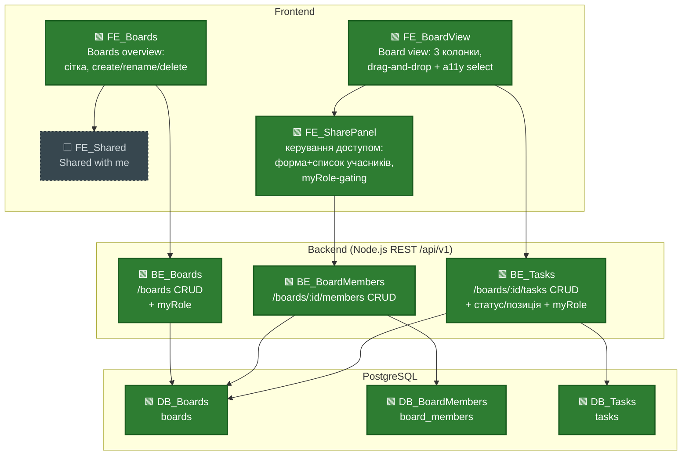
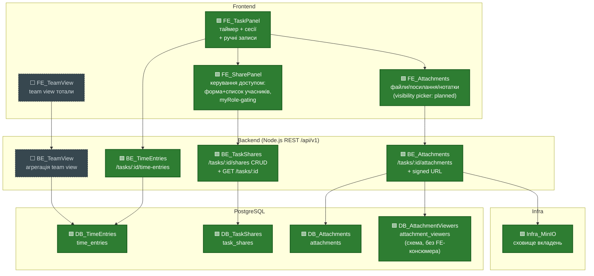
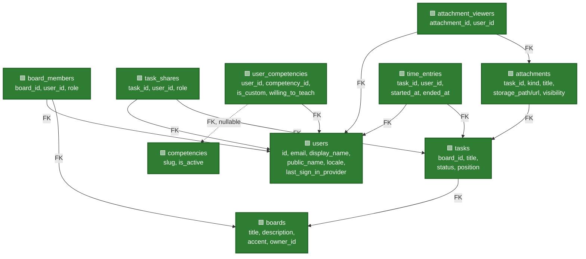

# PROJECT_MAP — Learning Time Tracker

Останнє оновлення: 2026-08-24 — профіль користувача (AUTH-004…AUTH-007): public_name, компетенції з довідника + custom, per-competency "готовий викладати"; нові вузли `FE_ProfilePage` (progress — без перемикача мови), `BE_Competencies`, `DB_Competencies`, `DB_UserCompetencies`.

## Легенда

| Позначка | Клас | Значення |
|---|---|---|
| 🟩 | `done` | FE + BE + БД (де застосовно) реалізовано і пройшло code review |
| 🟨 | `progress` | частково реалізовано (напр. UI без ендпоінта, або ендпоінт без UI) |
| ⬜ | `planned` | ще не почато, лише зафіксовано в специфікації як цільовий обсяг |

Карта розбита на три рядки за функціональними групами (Auth/Infra/Settings; Boards/Sharing; Task panel/Attachments/Team view) — у кожному рядку всі зв'язки замикаються всередині нього, тому стрілки між рядками не перетинаються.

## Рядок 1 — Auth, i18n, Infra

```mermaid
graph TD
  classDef done fill:#2e7d32,color:#ffffff,stroke:#1b5e20,stroke-width:2px;
  classDef progress fill:#f9a825,color:#1a1a1a,stroke:#f57f17,stroke-width:2px;
  classDef planned fill:#37474f,color:#cfd8dc,stroke:#263238,stroke-width:1px,stroke-dasharray: 3 3;

  subgraph FE["Frontend"]
    FE_i18n["🟩 FE_i18n<br/>locales/en+uk.json,<br/>I18nProvider, плюралізація"]
    FE_Auth["🟩 FE_Auth<br/>/auth: email+пароль,<br/>Google popup"]
    FE_ProfilePage["🟨 FE_ProfilePage<br/>/profile: public_name,<br/>компетенції + willing-to-teach<br/>(перемикач мови: planned)"]
  end

  subgraph BE["Backend (Node.js REST /api/v1)"]
    BE_Health["🟩 BE_Health<br/>GET /health"]
    BE_AuthMw["🟩 BE_AuthMw<br/>auth middleware,<br/>верифікація Firebase ID token"]
    BE_UsersMe["🟩 BE_UsersMe<br/>GET+PATCH /users/me<br/>(upsert, public_name),<br/>GET /auth/provider-hint"]
    BE_Competencies["🟩 BE_Competencies<br/>GET /competencies,<br/>/users/me/competencies CRUD"]
  end

  subgraph DB["PostgreSQL"]
    DB_Users["🟩 DB_Users<br/>users (+ locale,<br/>last_sign_in_provider,<br/>public_name)"]
    DB_Competencies["🟩 DB_Competencies<br/>competencies (довідник)"]
    DB_UserCompetencies["🟩 DB_UserCompetencies<br/>user_competencies"]
  end

  subgraph Infra["Infra"]
    Infra_Docker["🟩 Infra_Docker<br/>docker-compose:<br/>db/minio/backend/frontend"]
    Infra_FirebaseAuth["🟩 Infra_FirebaseAuth<br/>Firebase Auth Spark,<br/>email+пароль+Google"]
    Infra_MinIO["🟩 Infra_MinIO<br/>сховище вкладень"]
    Infra_ProdDeploy["⬜ Infra_ProdDeploy<br/>Cloud Run + Hosting<br/>+ Neon + R2/Blaze"]
  end

  FE_Auth --> FE_i18n
  FE_ProfilePage --> FE_i18n
  FE_Auth --> BE_AuthMw
  FE_Auth --> BE_UsersMe
  FE_Auth --> Infra_FirebaseAuth
  BE_AuthMw --> Infra_FirebaseAuth
  BE_UsersMe --> DB_Users
  FE_ProfilePage --> BE_UsersMe
  FE_ProfilePage --> BE_Competencies
  BE_Competencies --> DB_Competencies
  BE_Competencies --> DB_UserCompetencies
  Infra_Docker --> BE_Health
  Infra_Docker --> Infra_MinIO
  Infra_Docker -.план деплою.-> Infra_ProdDeploy

  class FE_i18n,FE_Auth,BE_Health,BE_AuthMw,BE_UsersMe,BE_Competencies,DB_Users,DB_Competencies,DB_UserCompetencies,Infra_Docker,Infra_FirebaseAuth,Infra_MinIO done;
  class FE_ProfilePage progress;
  class Infra_ProdDeploy planned;
```

## Рядок 2 — Boards, Board view, шеринг борду

## Рядок 3 — Task panel (час, шеринг таски, вкладення, team view)

## Схема БД (таблиці горизонтально, FK-звʼязки вертикально)

## Відомі прогалини / follow-ups (не блокери, залоговано для пізніше)

- **Orphaned Firebase account при мережевому збої під час signup** (стосується `FE_Auth` / `BE_UsersMe`). Якщо мережа падає між створенням акаунту в Firebase Auth і успішним upsert-запитом до `users`, а користувач перезавантажує сторінку саме в цей момент — акаунт у Firebase лишається без відповідного рядка в `users`, і зараз немає retry/self-heal логіки, яка б це виправила при наступному вході. Виявлено на code review `/auth` (approved with comments), не блокер для мержу. Потребує окремої фічі: або retry upsert при кожному logon, якщо `users` row відсутній, або фонова звірка Firebase Auth ↔ `users`.
- **Task rename UI (`FE_TaskPanel`) додано в обхід звичайного review pipeline.** На явний запит користувача (маленька, добре зрозуміла UI-правка: дзеркалить уже заапрувлений патерн board-rename з `BoardsPage.jsx`, використовує вже протестований і concurrency-safe BE-ендпоінт `PATCH /tasks/:id` без жодних змін на бекенді) — крок tester/code-reviewer цього разу пропущено. Зміни: `frontend/src/components/TaskPanel.jsx` (inline rename-форма: лейбл назви, save/cancel, client-side валідація) + `frontend/src/pages/BoardViewPage.jsx` (синхронізація заголовка картки таски після rename у панелі); нові локалі `task.rename.cta`, `task.rename.titleLabel`, `task.rename.validation.titleRequired`, `task.rename.validation.titleTooLong` — EN/UK повні. Користувач особисто перевірив наживо (успішний rename, валідація пустого/задовгого заголовка, 403 для не-власника), тестові дані прибрано вручну після переривання сесії агента. Статуси вузлів на карті **не змінені**: title-редагування вже неявно охоплювалось описом done-вузлів `BE_Tasks`/`DB_Tasks` ("CRUD"), а `FE_TaskPanel` лишається `progress` (вузол означає секцію "Час", не rename). Рекомендовано провести code-review pass, коли буде зручно — до того часу ця конкретна зміна має нижчу впевненість верифікації, ніж решта `done`-роботи на карті.

## Примітки

- `BE_Health` (`GET /health`) винесений окремим вузлом у BE-шарі Рядка 1, зʼєднаний з `Infra_Docker` — техендпоінт готовності сервісу backend-контейнера, не бізнес-фіча.
- `Infra_MinIO` показаний і в Рядку 1 (піднято в `docker-compose`), і в Рядку 3 (куди `BE_Attachments` писатиме файли) — це один і той самий вузол інфраструктури, повторений у двох діаграмах для наочності, не два різні сховища.
- `FE_SharePanel` (доданий у фічі "Board & Task Sharing", 2026-08-24) показаний і в Рядку 2 (керує `board_members` з `FE_BoardView`), і в Рядку 3 (керує `task_shares` з `FE_TaskPanel`) — за тим самим принципом повтору, що й `Infra_MinIO`: один і той самий компонент (`frontend/src/components/SharePanel.jsx`), що обслуговує обидва контексти шерингу, а не два різні компоненти.
- Секції "Поза межами цього етапу" з CLAUDE.md (публічні посилання, коментарі, нотифікації, календар, складні графіки) свідомо не винесені на карту — вони поза скоупом продукту, не просто "ще не зроблено".
- З фічі Boards/Board view/Task CRUD (2026-08-24): у проєкті зʼявилась перша автоматизована тест-інфраструктура — `vitest` проти окремої тестової Postgres-БД, `backend/test/concurrency/` (6 сценаріїв). Спільні locking-хелпери `backend/src/lib/db.js` (`lockRow`/`lockedUpdate`) і `backend/src/lib/authz.js` (`getOwnedBoard`) — це деталі реалізації всередині вже done-вузлів `BE_Boards`/`BE_Tasks`, окремих вузлів на карті не заведено, щоб не подрібнювати BE-шар нижче рівня ендпоінтів; згадано тут як доступна для наступних фіч база (regression-покриття конкурентних сценаріїв).
- З фічі Task attachments (2026-08-24): `FE_TaskPanel` позначений 🟨 `progress`, не `done` — цей вузол на карті означає саме секцію "Час" (таймер, сесії, ручні записи; звʼязки лишились `FE_TaskPanel --> BE_TimeEntries` і `--> BE_TaskShares`, обидва ще planned). У цій фічі вперше зʼявився сам компонент `TaskPanel` (бічна панель таски) як контейнер, і в ньому повністю реалізовано й заапрувено вкладення — тому додано нову стрілку `FE_TaskPanel --> FE_Attachments`, а `FE_Attachments` позначений `done` окремо. Секція "Час" у цій панелі ще не будувалась. `attachment_viewers`/visibility-picker (`private`/`shared`/`selected`) свідомо не реалізовувались цього разу — зараз усі вкладення `private` за замовчуванням, без UI вибору; `DB_AttachmentViewers` лишається ⬜ до фічі шерингу. `image/svg+xml` виключено зі списку дозволених типів файлів (FE + BE) як вектор stored-XSS — виправлено до approve, не є прогалиною.
- З фічі "Board & Task Sharing" (2026-08-24, US13-US17): `BE_BoardMembers`/`DB_BoardMembers` і `BE_TaskShares`/`DB_TaskShares` дороблено з ⬜ `planned` до 🟩 `done` — CRUD-ендпоінти `/boards/:id/members` і `/tasks/:id/shares` (8 нових ендпоінтів), новий `GET /tasks/:id`, `myRole` додано в 3 наявних ендпоінти (`GET /boards`, `GET /boards/:id/tasks`, `GET /tasks/:id`) — розширення контракту вже done-вузлів `BE_Boards`/`BE_Tasks`, за тим самим принципом, що й попередні CRUD-розширення (тотали, статуси). `DB_AttachmentViewers` також переведено в `done` — таблиця й FK існують і пройшли review, але це досі суто схема без FE-консюмера: visibility picker (`private`/`shared`/`selected`) у самих вкладеннях не будувався цього разу, `FE_Attachments` і надалі позначений "(visibility picker: planned)" без змін. Новий вузол `FE_SharePanel` (форма шерингу за email, список учасників з ролями, owner-рядок) доданий в обидва рядки (2 і 3) — замінив прямі стрілки `FE_BoardView --> BE_BoardMembers` і `FE_TaskPanel --> BE_TaskShares` на `--> FE_SharePanel -->`, оскільки шеринг тепер реально проходить через цей UI-компонент, а не є заглушкою. `frontend/src/lib/roles.js` (`canWrite`) і gating за `myRole` у `BoardViewPage.jsx`/`TaskPanel.jsx` — деталі реалізації всередині вже задокументованих FE-вузлів, окремих вузлів не заведено. Авторизація: `backend/src/lib/authz.js` розширено ефективною роллю owner/collaborator/viewer з пріоритетом board-level над task-level (`max(board role, task role)`, task-level ніколи не поширюється на інші таски того ж борду) і флагом `hasBoardAccess` — деталь реалізації всередині `BE_Boards`/`BE_Tasks`/`BE_TaskShares`, окремого вузла не заведено, той самий принцип, що вже застосований до `lockRow`/`getOwnedBoard`. Приватність часу лишається per-user незалежно від ролі (viewer теж таймить власний час, чужі рядки `time_entries` ніколи не повертаються). Два раунди tester (обидва фінально PASS) і два раунди code review: перший — Request changes через reindex-leak (стейл `myRole`/доступ у in-memory кеші після зміни ролі всередині того самого запиту переживав reindex списку і міг віддати застарілий дозвіл), другий — Approve, закомічено як `02de849`. Також виправлено мертвий locale-ключ у `SharePanel` і відсутній FK-індекс — обидва до approve, не відкладено. Свідомо не торкались: `FE_Shared` ("Shared with me" секція) і `FE_TeamView`/`BE_TeamView` — обидва лишаються ⬜ `planned`, поза скоупом цієї фічі (реалізовано лише саме керування доступом і UI шерингу).
- З фічі "Board/task description у FE" (2026-08-24): `boards.description` і `tasks.notes` існували в БД/BE й раніше (закладені в схему з самого початку), але не мали жодного UI — ця фіча підключає обидва поля до FE, без зміни схеми й без нових ендпоінтів. Board: форма створення, inline-форма перейменування, 2-рядковий preview на картці борду, заголовок Board view. Task: форма створення (`BoardViewPage.jsx`) і нова секція опису в `TaskPanel.jsx` (перегляд/редагування, дзеркалить UX уже існуючого title-rename) — свідомо перевикористовує вже наявну колонку `notes`, релейбловану "Description" в UI, а не нова колонка. Додано валідацію 2000 символів на BE для обох полів (раніше не валідувалось для `boards.description`, вперше з'явилось для `tasks.notes`) з відповідними error-ключами, повні EN/UK локалі, оновлення `openapi.yaml`. Статуси вузлів на карті **не змінені** і нових вузлів не додано — фіча повністю лягла всередину вже done-вузлів `FE_Boards`, `FE_BoardView`, `FE_TaskPanel`, `BE_Boards`, `BE_Tasks`, `DB_Boards`, `DB_Tasks`: це UI- і валідаційне розширення вже задокументованих CRUD-ендпоінтів, той самий принцип, що й попередні розширення контракту (тотали, myRole, шеринг). Code review → Approve.
- З фічі "Профіль користувача" (2026-08-24, AUTH-004…AUTH-007): новий вузол `FE_ProfilePage` (`/profile`) замінив попередній planned-заглушку `FE_Settings` ("профіль, перемикач мови") у Рядку 1 — і навмисно позначений 🟨 `progress`, не `done`. У цьому проході повністю реалізовано й пройшло tester+code review: редагування `public_name` (з фолбеком на системний `display_name`), додавання компетенцій з довідника й вручну (custom), per-competency перемикач "готовий викладати" — усі чотири story (AUTH-004…AUTH-007) закриті. **Перемикач мови на `/profile` НЕ реалізований цього разу** — `frontend/src/pages/ProfilePage.jsx` не містить відповідного UI; формулювання нового п.5 "User profile" в CLAUDE.md ("перемикач мови (див. розділ 'Локалізація')") зафіксовано заздалегідь разом з рештою екрана, але саму мовну частину ще не збудовано — те саме зауваження зробив code-reviewer при Approve with comments. Не позначати `FE_ProfilePage` як `done`, доки локале-перемикач не буде реалізовано і заверифіковано окремою фічею. Нові `done`-вузли: `BE_Competencies` (`GET /competencies` — довідник; `GET/POST/PATCH/DELETE /users/me/competencies` — власні записи користувача, anti-enumeration на чужий `:id` через 404, той самий підхід, що й для `time_entries`), `DB_Competencies` (таблиця `competencies`, засіджена 6 slug'ами з locale-ключами `competency.<slug>` в обох словниках), `DB_UserCompetencies` (таблиця `user_competencies`, `UNIQUE(user_id, competency_id)` як backstop проти дублю з довідника; дублі custom-записів свідомо дозволені — NULL у `competency_id` не конфліктує). Вже задокументовані `done`-вузли розширені без зміни статусу: `BE_UsersMe` отримав `PATCH /users/me` (тільки `publicName`, часткове оновлення — відсутнє поле в тілі не чіпає `public_name`); `DB_Users` отримав колонку `public_name`. Побічний контрактний ефект на вже `done` вузлах шерингу — `BE_BoardMembers`/`BE_TaskShares` (`toMember`/`toShare` у відповідних сервісах) тепер віддають `displayName` як `public_name || display_name` замість завжди `display_name` у списках учасників борду/шерингу таски (AUTH-004 AC5/AC6) — на карті це не окрема стрілка (обидва вузли лишаються в Рядку 2/3, `DB_Users` — у Рядку 1, міжрядкові стрілки навмисно не проводяться), зафіксовано тут текстом. Один раунд code review: Approve with comments (єдине зауваження — саме про недобудований перемикач мови, враховано вище).
- З фічі "Час у TaskPanel" (2026-08-24, US10-US12): `FE_TaskPanel` дороблено до 🟩 `done` — секцію "Час" додано (таймер старт/стоп, живий лічильник, банер auto-stop-and-switch при переключенні активної таски, форма ручного запису, список сесій з edit/delete). `BE_TimeEntries` (6 ендпоінтів: `POST start`, `POST stop`, `POST manual`, `PATCH :entryId`, `DELETE :entryId`, `GET list` на `/tasks/:id/time-entries`) і `DB_TimeEntries` (таблиця `time_entries` + міграція `20260824110000_create_time_entries_table.js`, partial unique index `time_entries_one_active_per_user` на `(user_id) WHERE ended_at IS NULL` — гарантує один активний таймер на користувача на рівні БД) також `done`. Тотали часу додані на `GET /boards/:id/tasks` (`totalSeconds` на тасці, `columnTotals`, `boardTotalSeconds`) і на `GET /boards` (`totalSeconds`, `thisWeekSeconds`, заміна заглушки `board.card.totalTimePlaceholder`) — це розширення контракту вже done-вузлів `BE_Boards`/`BE_Tasks`, окремих вузлів не заведено (той самий принцип, що й для попередніх CRUD-розширень). `thisWeekSeconds` рахується від понеділка 00:00 UTC, фіксовано явно, без локального часу користувача. Приватність: `time_entries` завжди фільтруються `WHERE user_id = requester`; PATCH/DELETE чужого чи неіснуючого запису дають однаковий 404 (anti-enumeration, ніколи 403) — перевірено tester'ом прямим SQL-інсертом "чужого" рядка. Один раунд code review (Request changes → Approve): виправлено race-баг у retry-логіці `startTimer` (ліміт 2 спроби не витримував 3+ одночасних гонщиків) — збільшено до `MAX_START_ATTEMPTS=8` з чесним `errors.timeEntry.startConflict` замість оманливого коду помилки; побічно виправлено баг у `scripts/i18n-check.js` (шлях був `frontend/locales/` замість `frontend/src/locales/` — гейт локалізації мовчки нічого не перевіряв), тепер гейт коректно розрізняє відсутні в EN ICU plural-категорії (`few`/`many`) від справжніх пропусків перекладу. Новий тестовий файл `backend/test/concurrency/timeEntries.concurrency.test.js` (4 сценарії: подвійний старт таймера з двох вкладок, PATCH-vs-DELETE, DELETE-vs-DELETE на той самий запис) — разом з попередніми доводить concurrency-покриття до 12 сценаріїв (боарди/таски/вкладення/час).
